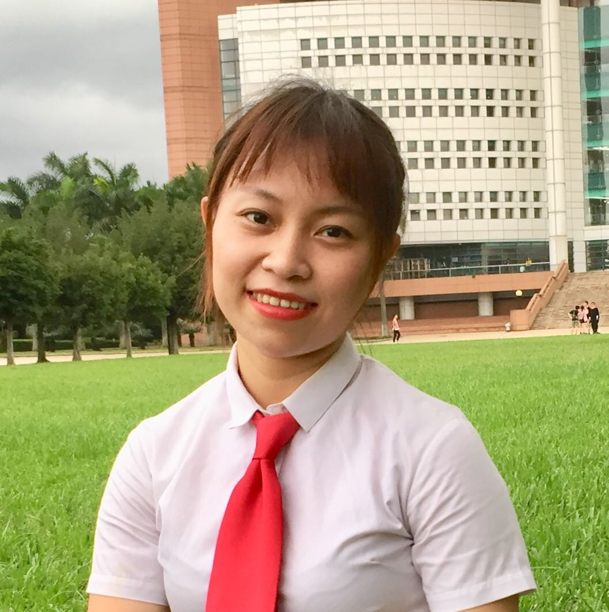

**Research Asisitant in [School of Data and Computer Science (SDCS)](http://sdcs.sysu.edu.cn/), [Sun Yat-sen University (SYSU)](http://www.sysu.edu.cn/2012/en/index.htm)**

**Tel: +86 159 8918 0014**

**Email: huangl223@mail2.sysu.edu.cn**

**Address: East Campus of SYSU, Guangzhou, P.R. China, 510006**

### Research Interests

- Software engineering, formal methods, model-based development of Cyber-Physical Systems (CPS),
real-time embedded systems.

- Tool-supported formal verification and validation techniques (e.g., Model-Checking, SAT/SMT solving).

- Probabilistic analysis of software-intensive systems.

## Education
** Master, Software Engineering (2017 - 2019)**
- School of Data and Computer Science, Sun Yat-Sen University
- Master’s Thesis: Tool Supported Verification of (Non)-functional Requirements in Cyber Physical Systems Using Simulink Design Verifier 
- Advisor: Associate Prof. Eun-Young Kang

** Bachelor, Software Engineering (2013 - 2017)**
- School of Data and Computer Science, Sun Yat-Sen University
- GPA: 3.9/5.0 (top 10%)
- Bachelor’s Thesis: Tool Supported Verification and Validation of Automotive Systems

## Award
- European Joint Conferences on Theory and Practice of Software (ETAPS), Prague, Czech Republic, Student Scholarship (2019)
- Formal Methods in Computer-Aided Design (FMCAD), University of Texas, Austin, USA, Student
Forum Travel Award (2018)
- Chinese National Endeavor Scholarship (3 times, 2013 - 2016, awarded by Chinese Government for top 30% students)
- Excellent Student Scholarship (3 times, top 20% based on GPA, 2013 - 2016)
- Excellent Team in Ke Teng Cup Software Creativity Competition (top 5 teams, 2014)

## Teaching Asistant
- Computer Language and Implementation, Sun Yat-Sen University, School of Data and Computer
Science, Software Engineering Institute, Spring 2017, 2018.
- Introduction to Cyber-Physical Systems: Intelligent Vehicle Software Design, Sun Yat-Sen University, School of Data and Computer Science, Software Engineering Institute, Spring 2017, 2018.
- Introduction to Real-Time Systems, Sun Yat-Sen University, School of Data and Computer Science,
Software Engineering Institute, Fall 2017, 2018.

## Publications
### International Conference Publications
C1. Li Huang, Tian Liang and Eun-Young Kang. "Formal Verification of Dynamic and Stochastic Behaviors for Automotive Systems." In the *International Conference on Engineering of Complex Computer Systems (ICECCS)*, Hong Kong, China, November, 2019.

C2. Li Huang, Tian Liang and Eun-Young Kang. "Tool-Supported Analysis of Dynamic and
Stochastic Behaviors in Cyber-Physical Systems." In the International Conference on Software Quality, Reliability, and Security (QRS), University of Sofia, Sofia, Bulgaria, July, 2019.

C3. Li Huang and Eun-Young Kang. \Formal Verification of Safety & Security Related Timing Constraints for A Cooperative Automotive System." In the European Joint Conferences
on Theory and Practice of Software (ETAPS-FASE), pp. 210-227, Springer, Prague, Czech
Republic, April, 2019.

C4. Li Huang and Eun-Young Kang. \SMT-based Probabilistic Analysis of Timing Constraints
in Cyber-Physical Systems." In the Formal Methods in Computer-Aided Design (FMCAD)
Student Forum, University of Texas, Austin, USA, October, 2018.

C5. Eun-Young Kang and Li Huang (Presenter). \Probabilistic Analysis of Timing Constraints
in Autonomous Automotive Systems using Simulink Design Verifier." In the International
Symposium on Dependable Software Engineering Theories, Tools and Applications (SETTA),
pp. 170-186, Springer, Beijing, China, September 2018.

C6. Eun-Young Kang, Dongrui Mu, and Li Huang. \Probabilistic Verification of Timing Constraints in Automotive Systems using UPPAAL-SMC." In the International Conference on
Integrated Formal Methods (IFM), pp. 236-254, Springer, Maynooth, Ireland, September 2018.

C7. Eun-Young Kang, Li Huang, and Dongrui Mu. \Formal Verification of Energy and Timed
Requirements for a Cooperative Automotive System." In the ACM/SIGAPP Symposium On
Applied Computing in Software Engineering (SAC), pp. 1492-1499, ACM, Pau, France, April
2018.

C8. Eun-Young Kang, Dongrui Mu, Li Huang, and Qianqing Lan. \Verification and Validation
of a Cyber-Physical System in the Automotive Domain." In International Conference on
Software Quality, Reliability and Security (QRS), pp. 326-333, IEEE, Prague, Czech Republic,
July 2017.

C9. Eun-Young Kang, Dongrui Mu, Li Huang and Qianqing Lan. \Model-Based Analysis of
Timing and Energy Constraints in an Autonomous Vehicle System." In International Conference on Software Quality, Reliability and Security (QRS), pp. 525-532, IEEE, Prague, Czech
Republic, July 2017.

